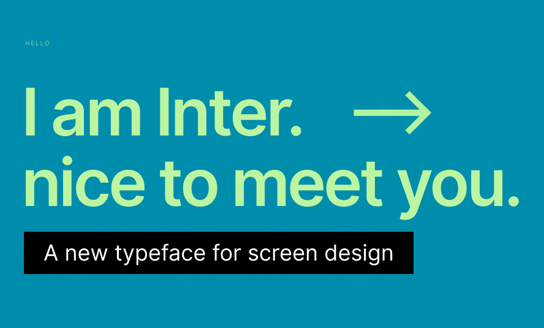

The FastTrack products use the <a href="https://rsms.me/inter/" target="_blank">Inter</a> typeface.

#### Scaling
FastTrack's type scale is loosely referred from Bootstrap framework and is based on an initial increase of 2px that grows to 4px in larger font sizes to favor contrast and improve readability. It follows a non-linear arithmetic progression that's understandable and easy to use in both simple and complex applications.

| px | rem |
| --- | --- |
| 10px | 0.625rem |
| 12px | 0.75rem |
| 14px | 0.875rem |
| 16px | 1rem |
| 18px | 1.125rem |
| 20px | 1.25rem |
| 24px | 1.5rem |
| 28px | 1.75rem |
| 32px | 2rem |
| 36px | 2.25rem |
| 40px | 2.5rem |

#### Weight
For efficiency and simplicity, FastTrack only incorporates three font weights for content:

| Font Weights  | Reference     |
| ------------- |:-------------:|
| Normal        | 400           |
| Semibold      | 600           |
| Bold          | 800           |
